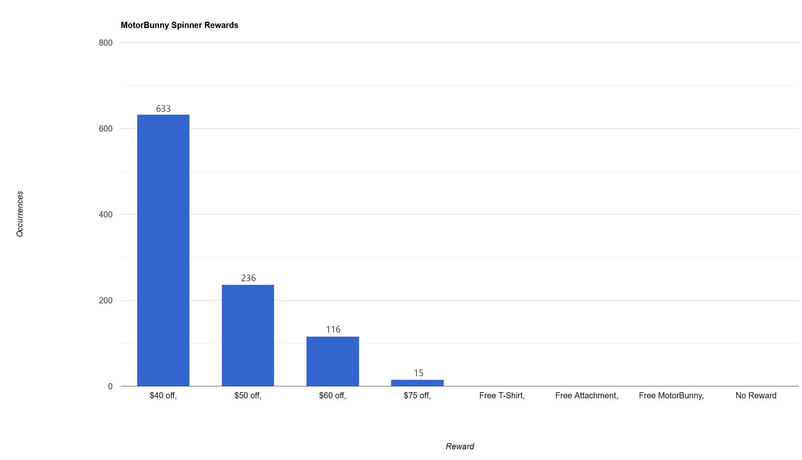

# MotorBunnySpinnerRewardsTracker
A simple script used to record MotorBunny Rewards from a spinner *solely to run statistical analysis on*. This should not be used to farm discount codes. I denounce any responsibilty for misuse of the system.

## Setup
To run this project, you will need [Python 3](https://www.python.org/downloads/) installed as well as [GeckoDriver](https://github.com/mozilla/geckodriver/releases) installed and setup. Before running the script, please be sure to adjust the `LOOP_COUNT` and `FULLY_QUALIFIED_FILE_PATH` variable values on lines 17 and 19 of main.py to be what best fits your use case. The `PHONE_NUMBER` value on line 21 can also be changed. As it is, it will use a random 10 digit string, but this can fail often and lengthen the run time. You can change it to a valid number at  your own discretion.

## Example Stats:

A file like [motorbunny_codes.txt](Resources/motorbunny_codes.txt) will be generated. This information can then be used to generate charts on any charting software you'd like for statistical analysis, like so:

